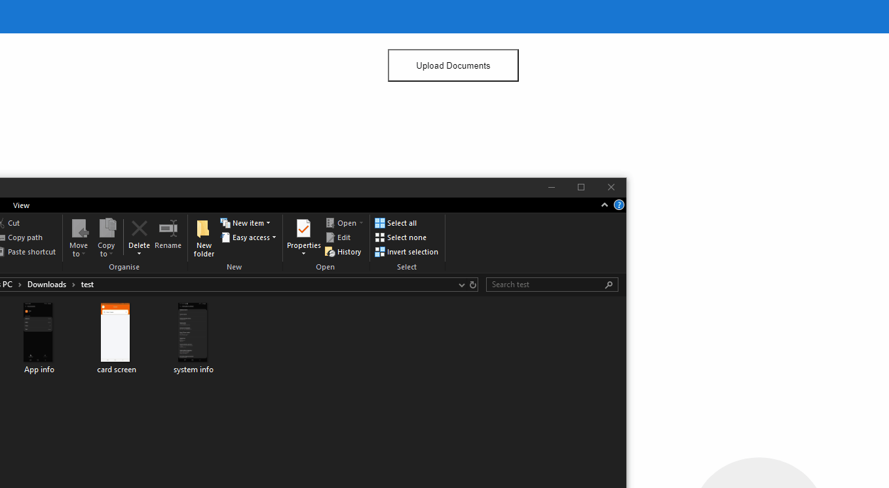

[![Contributors][contributors-shield]][contributors-url]
[![Forks][forks-shield]][forks-url]
[![Stargazers][stars-shield]][stars-url]
[![Issues][issues-shield]][issues-url]
[![MIT License][license-shield]][license-url]

<!-- PROJECT LOGO -->
<br />
<p align="center">
  <a href="https://github.com/CESARBR/angular-dragndrop-input">
    
  </a>

  <h3 align="center">Angular Drag and Drop</h3>

  <p align="center">
    Drag and drop directive adds a behavior to elements in your Angular applications where you can receive a list of files
    <br />
    <br />
    <a href="https://github.com/CESARBR/angular-dragndrop-input/issues">Report Bug</a>
    ·
    <a href="https://github.com/CESARBR/angular-dragndrop-input/wiki">Wiki</a>
  </p>
</p>


<!-- TABLE OF CONTENTS -->
<div>
  <summary><h2 style="display: inline-block">Table of Contents</h2></summary>
  <ol>
    <li>
      <a href="#about-the-project">About The Project</a>
      <ul>
        <li><a href="#built-with">Built With</a></li>
      </ul>
    </li>
    <li>
      <a href="#getting-started">Getting Started</a>
      <ul>
        <li><a href="#prerequisites">Prerequisites</a></li>
        <li><a href="#installation">Installation</a></li>
      </ul>
    </li>
    <li><a href="#usage">Usage</a></li>
    <li><a href="#roadmap">Roadmap</a></li>
    <li><a href="#contributing">Contributing</a></li>
    <li><a href="#license">License</a></li>
    <li><a href="#contact">Contact</a></li>
  </ol>
</div>

## About The Project



### Built With

* [Angular](https://angular.io)
* [TypeScript](https://www.typescriptlang.org)
* [SASS](https://sass-lang.com)

## Getting Started

To get a local and running follow these simple steps.

### Prerequisites

Install NPM packages

* npm
  ```sh
  npm install npm@latest -g
  ```

### Installation

1. With [npm](https://npmjs.org/) installed, run.
   ```sh
   npm i @cesarbr/angular-dragndrop-input
   ```

## Usage

Import NgDragndropInput on module
```ts
import { NgModule } from '@angular/core';
import { AppComponent } from './app.component';
import { NgDragndropInput } from 'ng-dragndrop-input';

@NgModule({
  declarations: [AppComponent],
  imports: [NgDragndropInput],
  providers: [],
  bootstrap: []
})
export class AppModule { }
```

Using the directive on your component and listen 'fileDropped' emitter
```html
<div dragndrop
    (fileDropped)="uploadFiles($event)">
    <button
    class="upload-button">Upload Documents</button>
</div>
```

FileDropped event emitter a 'FileList' you can use as you prefer
```ts
import { Component, EventEmitter, OnInit, Output } from '@angular/core';

@Component({
  selector: 'app-button-with-drop',
  templateUrl: './button-with-drop.component.html',
  styleUrls: ['./button-with-drop.component.scss']
})
export class ButtonWithDropComponent implements OnInit {

  @Output() filesToUpload = new EventEmitter<any>();

  public uploadFiles(fileList: any) {
    this.filesToUpload.emit(fileList);
  }

}
```

## Roadmap

See the [open issues](https://github.com/CESARBR/angular-dragndrop-input/issues) for a list of proposed features (and known issues).

## Contributing

Contributions are what make the open source community such an amazing place to be learn, inspire, and create. Any contributions you make are **greatly appreciated**.

1. Fork the Project
2. Create your Feature Branch (`git checkout -b feature-IssueNumber`)
3. Commit your Changes (`git commit -m 'Create a new feature or fix bug'`)
4. Push to the Branch (`git push origin feature-IssueNumber`)
5. Open a Pull Request

## License

Distributed under the MIT License. See `LICENSE` for more information.

## Contact

Project Link: [https://github.com/CESARBR/angular-dragndrop-input](https://github.com/CESARBR/angular-dragndrop-input)


<!-- MARKDOWN LINKS & IMAGES -->
[contributors-shield]: https://img.shields.io/github/contributors/CESARBR/angular-dragndrop-input.svg?style=for-the-badge
[contributors-url]: https://github.com/CESARBR/angular-dragndrop-input/graphs/contributors
[forks-shield]: https://img.shields.io/github/forks/CESARBR/angular-dragndrop-input.svg?style=for-the-badge
[forks-url]: https://github.com/CESARBR/angular-dragndrop-input/network/members
[stars-shield]: https://img.shields.io/github/stars/CESARBR/angular-dragndrop-input.svg?style=for-the-badge
[stars-url]: https://github.com/CESARBR/angular-dragndrop-input/stargazers
[issues-shield]: https://img.shields.io/github/issues/CESARBR/angular-dragndrop-input.svg?style=for-the-badge
[issues-url]: https://github.com/CESARBR/angular-dragndrop-input/issues
[license-shield]: https://img.shields.io/github/license/CESARBR/angular-dragndrop-input.svg?style=for-the-badge
[license-url]: https://github.com/CESARBR/angular-dragndrop-input/blob/main/LICENSE
